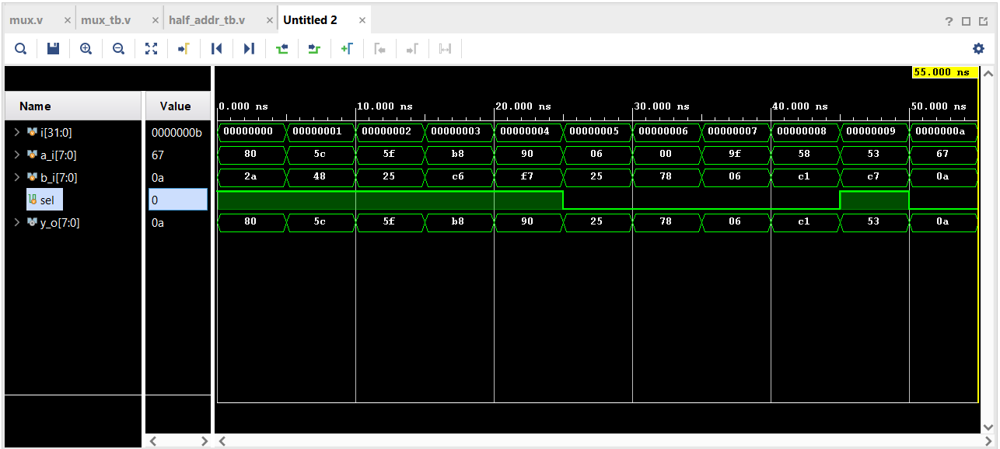

## Day 1
Design & Verify mux.

### Interface Definition
The module should have the following interface:
```verilog
    input wire [7:0] a_i,
    input wire [7:0] b_i,
    input wire sel,
    output wire [7:0] y_o
```

### Simulation
